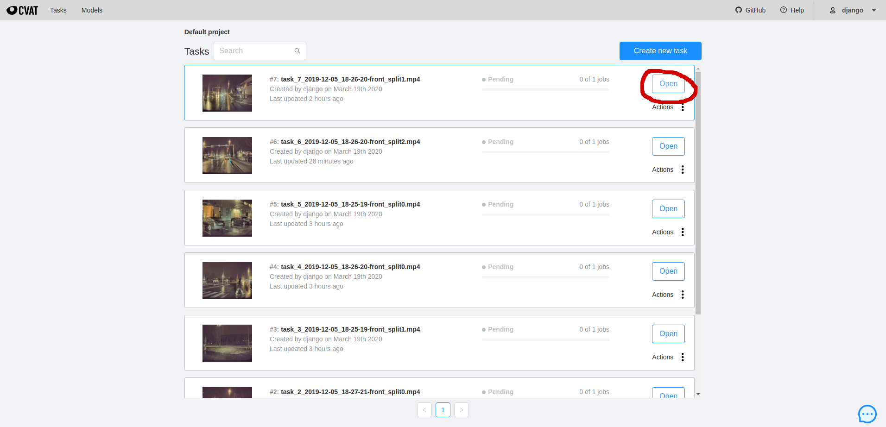

# Login
Open the link to the annotation web server, and log in with your provided username and password.
https://tdt4265-annotering.idi.ntnu.no/

# Open task
Open one of the available tasks visible in the task list by clickong the blue open button.

# Change assignee
From the highlighted drop-down menu, assign the task to your username. This will hide the task from other annotators. Then click the circeled job text to start annotation.

# Used labels
These are the labels that you are supposed to be annotating: 

* dog 
* stop 
* sign 
* traffic 
* light 
* truck 
* bus
* motorcycle 
* bicycle 
* person 
* car

The other available labels are part of the cityscapes dataset, but are not used in this project.

# Annotation

The video file will be browsable on the canvas as shown in the image below. 

Normal playback of the video can be started and paused with the spacebar, and for a frame by frame view, the D and F keys can be used to skip forwards or backwards, frame by frame. The canvas itself can be moved by clicking and dragging, and using the mouse wheel to zoom in and out.

All tasks come preprocessed with some annotations already in place, but it is your job to complete the task of annotating all relevant classes in every frame of the video,and correct the existing bounding boxes. The bounding boxes already there can be adjusted by clicking and dragging the box corners, and new bounding boxes can be made by clicking the "create new shape" button in the lower right corner.  

You will now be able to create a new bounding box by clicking on the frame shown on the canvas. , , .

Make sure to select the correct class in the dropdown menu below the "create new shape button", and try to experiment with the difference between interpolation and annotation drop down options. 
If you create annotation squares, try to experiment with the shortcut "ctrl+b", which propogates the current bounding box a set amount of frames forwards in time. This can save time if the object in question does not move much relative to the frame. To delete a bounding box, click the bounding box in question and hit the delete button.

# Task complete
When you complete all frames in the task, mark the task as completed and assign yourself another task from the task list.
,  

Remember to save your work, either from the menu in the bottom left, or hit ctrl+s.

